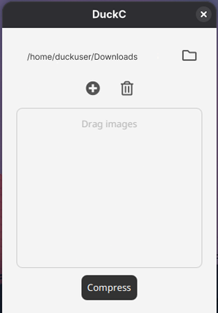

# 🦆 DuckC - Image Compressor (Only RPM for now)

**DuckC** is a modern, lightweight desktop application developed in **JavaFX**, designed for efficient image compression.

<p align="center">
  
</p>

## ✨ Key Features

- **Optimized Compression:** Reduce the weight of your images while maintaining an excellent quality-to-size ratio.
- **Intuitive Interface:** Simple UI developed with **FXML**.
- **Persistence:** User preferences service to remember your custom settings.
- **Native Installers:** Support for generating **.rpm**, **.deb** (Linux) and **.msi**, **.exe** (Windows) packages.

## 🛠️ Technologies

- **Java 21+**
- **JavaFX 21** (UI Framework)
- **Maven** (Dependency Management)
- **jpackage** (Native Packaging)

## 🚀 Download & Installation

You can get the latest stable version from the **Releases** section. Select the installer corresponding to your operating system:

### 🐧 Linux (RPM - Fedora, Red Hat, openSUSE)

Download the `.rpm` and install:

```bash
sudo dnf install ./DuckC-1.0.rpm
```
